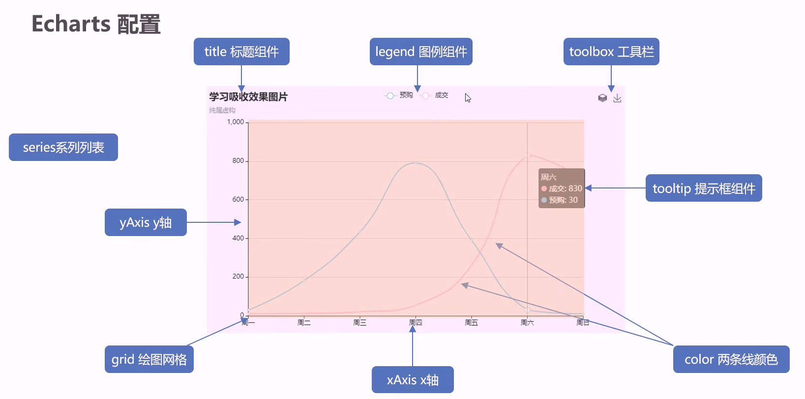

1. 使用`flexible.js`，针对屏幕1920px，平分24份，1rem为80px
2. 使用cssrem插件，设置80px（当我们书写px时，根据80px为1rem的换算关系自动转换）
3. 使用easyless自动编译`.less`文件

# echarts使用基本步骤

1. 下载echarts（这里引入echarts.js文件——echarts的js代码）
2. 准备一个**具备大小**的DOM容器——存放图表
3. 初始化echarts实例对象
4. 指定配置项和数据
5. 将配置项设置给echarts实例对象

## 举例

~~~html
<!DOCTYPE html>
<html lang="en">
  <head>
    <meta charset="UTF-8" />
    <meta name="viewport" content="width=device-width, initial-scale=1.0" />
    <title>Document</title>
    
  </head>
  <body>
    

    
    
  </body>
</html>
~~~

# echarts基础配置

## 举例

~~~html
<!DOCTYPE html>
<html lang="en">
  <head>
    <meta charset="UTF-8" />
    <meta name="viewport" content="width=device-width, initial-scale=1.0" />
    <title>Document</title>
    
  </head>
  <body>
    

    
    
  </body>
</html>
~~~

